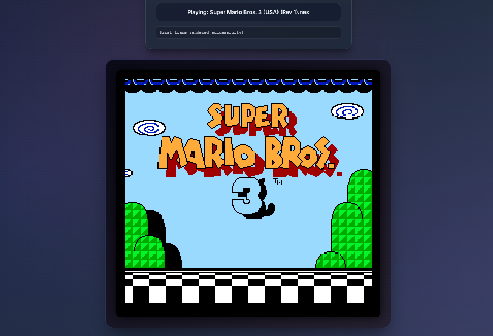

# 🎮 Retro Emulator

A modern, browser-based retro gaming emulator that runs classic Nintendo games entirely in your web browser. Upload your own ROM files for a fully legal gaming experience.

[](https://x1n-q.github.io/Web-Based-Emulator/)


## 📸 Screenshot



*NES emulator running in the browser with the refreshed console-style interface*

## ✨ Features

- 🎮 **NES Emulation** - Fully functional Nintendo Entertainment System emulator
- 🎮 **GBA Emulation** - Game Boy Advance support (WebAssembly-based)
- ⌨️ **Customizable Controls** - Remap keys to your preference with the built-in control configurator
- 💾 **Persistent Settings** - Your control mappings are saved automatically
- 🎨 **Console-Inspired UI** - Cleaner flat interface with a focused local-runtime workspace
- 📱 **Responsive Design** - Works on desktop, tablet, and mobile devices
- 🚀 **No Installation Required** - Runs entirely in your browser

## 🎯 Supported Systems

- ✅ **Nintendo Entertainment System (NES)** - Fully working
- 🚧 **Game Boy Advance (GBA)** - In development (requires WASM setup)

## 🚀 Quick Start

### Prerequisites

- A modern web browser (Chrome, Firefox, Safari, or Edge)
- A local web server (required due to browser security restrictions)

### Installation

1. **Clone or download this repository**
   ```bash
   git clone https://github.com/x1n-Q/Web-Based-Emulator.git
   cd Web-Based-Emulator
   ```

2. **Start a local web server**

   **Using Python 3:**
   ```bash
   python -m http.server 8000
   ```

   **Using Python 2:**
   ```bash
   python -m SimpleHTTPServer 8000
   ```

   **Using Node.js:**
   ```bash
   npx http-server -p 8000
   ```

   **Using PHP:**
   ```bash
   php -S localhost:8000
   ```

3. **Open your browser**
   - Navigate to `http://localhost:8000`
   - Select your system (NES or GBA)
   - Click "Choose File" and select your ROM file
   - Start playing!

### Recommended Sample ROM

For safe demos and screenshots, use a legal homebrew NES ROM rather than copyrighted commercial games.

- `Spacegulls (NES)` by Morphcat Games: https://morphcatgames.itch.io/spacegulls

## 📁 Project Structure

```
retro-emulator/
├── index.html              # Main HTML structure
├── style.css               # Console-style layout and visual system
├── main.js                  # Application entry point
├── emulator.js              # Emulator core logic
├── controls.js              # Input handling system
├── controlSettings.js       # Control configuration UI
├── screenshot.png           # NES emulator screenshot
├── LICENSE                  # MIT License
├── README.md                # This file
└── (mgba.wasm & mgba.js)   # Optional: GBA WASM files
```

**Note**: To add your own screenshot:
1. Take a screenshot of the NES emulator running a game
2. Save it as `screenshot.png` in the project root directory
3. The README will automatically display it

## ⌨️ Controls

### Default Keyboard Mappings

**NES:**
- **D-Pad**: Arrow Keys or WASD
- **A Button**: Z, J, or N
- **B Button**: X, K, or M
- **Start**: Enter or Space
- **Select**: Shift or C

**GBA:**
- **D-Pad**: Arrow Keys or WASD
- **A Button**: Z, J, or N
- **B Button**: X, K, or M
- **L Button**: Q
- **R Button**: E
- **Start**: Enter or Space
- **Select**: Shift or C

### Customizing Controls

1. Click the **"⚙️ Configure Controls"** button
2. Select your system (NES or GBA)
3. For each button:
   - Click **"+ Add Key"** and press the key you want to assign
   - Remove keys by clicking the **×** button on key badges
4. Click **"Save Controls"** to save your settings
5. Your custom controls are automatically saved and will persist across sessions

## 🔧 Technical Details

### Emulator Cores

- **NES**: Uses [jsnes](https://github.com/bfirsh/jsnes) - A JavaScript NES emulator
- **GBA**: Uses mGBA compiled to WebAssembly - A C-based GBA emulator compiled with Emscripten

### GBA WebAssembly Setup

The GBA emulator requires mGBA compiled to WebAssembly. The emulator will:

1. **First try to load local WASM files** (`mgba.wasm` and `mgba.js`) from the project directory
2. **Fall back to CDN sources** if local files aren't available
3. **Use a JavaScript fallback** if WASM isn't available (for development/testing)

#### To Use Your Own Compiled mGBA WASM:

1. **Install Emscripten SDK:**
   ```bash
   git clone https://github.com/emscripten-core/emsdk.git
   cd emsdk
   ./emsdk install latest
   ./emsdk activate latest
   source ./emsdk_env.sh
   ```

2. **Compile mGBA:**
   ```bash
   git clone https://github.com/mgba-emu/mgba.git
   cd mgba
   # Follow mGBA's build instructions for Emscripten
   # This will generate mgba.js and mgba.wasm files
   ```

3. **Place the compiled files** in your project directory:
   - `mgba.wasm` - The WebAssembly binary
   - `mgba.js` - The Emscripten JavaScript loader

4. **The emulator will automatically detect and use them** when you load a GBA ROM

**Note**: For best performance, use the compiled WASM version. The JavaScript fallback is provided for testing purposes.

## 📋 Supported ROM Formats

| System | File Extensions |
|--------|----------------|
| NES    | `.nes`         |
| GBA    | `.gba`         |

## 🌐 Browser Compatibility

- ✅ Chrome/Edge (recommended)
- ✅ Firefox
- ✅ Safari
- ✅ Opera

**Note**: For best performance, use the latest version of your browser.

## 🐛 Troubleshooting

### ROM won't load
- Ensure the file extension matches the selected system
- Verify the ROM file is not corrupted
- Try a different ROM file to test

### GBA emulator not working
- Check browser console (F12) for error messages
- Ensure you have a compiled `mgba.wasm` and `mgba.js` in the project directory
- Try using a different browser
- Check your internet connection if using CDN sources

### Controls not working
- Click on the game screen to ensure focus
- Open the control settings button and verify your key mappings
- Try refreshing the page

### Game runs slowly
- Close other browser tabs
- Try a different browser
- Some games are more demanding than others
- Ensure your device meets minimum requirements

### CORS errors
- **Important**: You must use a web server (not `file://` protocol)
- Use one of the server methods listed in the Quick Start section
- Access the emulator via `http://localhost:8000` (or your chosen port)

## ⚖️ Legal Disclaimer

**IMPORTANT**: This emulator does not host, distribute, or provide any ROM files. Users must provide their own legally obtained ROM files.

- Uploading copyrighted ROMs that you do not own is illegal
- Only use ROMs for games you legally own
- This emulator is for educational and preservation purposes
- The developers are not responsible for any illegal use of this software

## 🙏 Credits

- **[jsnes](https://github.com/bfirsh/jsnes)** - JavaScript NES emulator by bfirsh
- **[mGBA](https://github.com/mgba-emu/mgba)** - C-based GBA emulator by mGBA Team
- **[Emscripten](https://emscripten.org/)** - For compiling C code to WebAssembly
- **Web Audio API** - For audio playback
- **HTML5 Canvas** - For game rendering

## 📄 License

This project is licensed under the MIT License - see the [LICENSE](LICENSE) file for details.

The emulator itself is free to use, but ROM files are subject to their respective copyright holders.

---

**Enjoy retro gaming in your browser!** 🎮

Made with ❤️ for retro gaming enthusiasts
